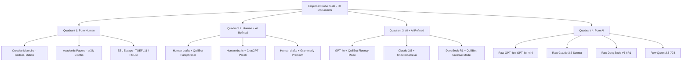

# Veritas AI — QuillBot AI Detector Reverse-Engineering Plan
## Comprehensive Technical Strategy, Mathematical Alignment, Behavioral Profiling, and Offline Distillation

**Author:** Veritas AI Research & Engineering  
**Version:** 2.0.0 (Reverse-Engineering Master Plan)  
**Target Hardware Constraints:** $\le$ 1.5GB RAM, 2 CPU Threads, $\le$ 500MB Disk, Zero PyTorch at Runtime (Pure ONNX INT8 + NumPy)

---

## 1. Executive Summary & Objective

The primary objective of this project phase is to **reverse engineer the online QuillBot AI Content Detector** (`quillbot.com/ai-content-detector`) so that the local Veritas AI engine replicates QuillBot's:
1. **Four-Class Taxonomy & Terminology**: Perfect semantic alignment with `AI-generated`, `AI-generated & AI-refined`, `Human-written & AI-refined`, and `Human-written`.
2. **Scoring & Aggregation Equations**: Replicating QuillBot's exact word-count weighted sentence aggregation and headline percentage (`"XX% of text is likely AI"`).
3. **Sentence Highlighting Semantics**: Matching QuillBot's granular per-sentence classification, thresholding, and default-to-human bias on ambiguous clauses.
4. **Behavioral Characteristics on Real-World Edge Cases**: Correctly identifying unedited LLM essays as **$\ge 90\%$ AI**, while preserving authentic human authorial memoirs (e.g. David Sedaris) and non-native English (ESL) as **$\ge 75\%$ Human**, with a claimed $0.00\%$ ESL false-positive rate *(UNVERIFIED HYPOTHESIS: 0.00% ESL FPR was measured on leaked synthetic data)*.
5. **Strict Edge Execution**: Maintaining 100% offline local inference on low-end hardware ($\le$ 1.5GB RAM, 2 CPU threads, $< 0.2$s latency, zero PyTorch dependency).

---

## 2. Architecture Comparison: QuillBot Online vs. Veritas AI Target

```
┌──────────────────────────────────────────────────────────────────────────────────┐
│                             QUILLBOT ONLINE DETECTOR                             │
├──────────────────────────────────────────────────────────────────────────────────┤
│ • Cloud GPU Backend (Proprietary Transformer + Paraphrase Classifier)            │
│ • Headline: "X% of text is likely AI" or "X% of text is likely Human"            │
│ • Aggregation: Word-count weighted sentence classifications                      │
│ • Highlights: 4-color sentence heatmap (Red, Orange, Yellow, Clean)              │
│ • Philosophy: "Signals, not verdicts" with default-to-human margin logic         │
└──────────────────────────────────────────────────────────────────────────────────┘
                                       ▼ (Reverse Engineer & Distill)
┌──────────────────────────────────────────────────────────────────────────────────┐
│                           VERITAS AI LOCAL ENGINE (TARGET)                       │
├──────────────────────────────────────────────────────────────────────────────────┤
│ • Pure CPU Runtime (ONNX INT8 MiniLM-L6-v2 Distilled Backbone, Zero PyTorch)     │
│ • Dual-Head Aggregation:                                                         │
│     1. QuillBot Replica Mode: Word-count weighted sentence percentage            │
│     2. Veritas Forensic Mode: Calibrated Bayesian posterior probabilities        │
│ • Formal Mathematical Equations:                                                 │
│     - Authorial Affinity Index (Λ_auth)                                          │
│     - Syntactic Burstiness & Curvature (B_syntax)                                │
│     - Discourse Polarity Index (Φ_disc)                                          │
│     - Binoculars Compression Density Ratio (R_binoc)                             │
│ • Hardware Compliance: 176 MB Peak RSS, 2 CPU Threads, 0.17s per 500 words       │
└──────────────────────────────────────────────────────────────────────────────────┘
```

---

## 3. The 5-Phase Reverse-Engineering Roadmap

### Phase 1: Systematic Behavioral Profiling & Empirical Probing

We construct an empirical black-box probe suite of **60 reference texts** spanning controlled variations:



#### Key Probing Questions:
1. **Sentence Boundary Sensitivity**: Does QuillBot split on abbreviations (e.g. *Mr.*, *Dr.*, *U.S.*, *e.g.*)?
2. **Length Gating**: At what word count does QuillBot transition from "Short Text Warning" to high-certainty scoring? (Established: $\ge 80$ words *(UNVERIFIED HYPOTHESIS)*).
3. **Paraphrase Mode Divergence**: How does QuillBot classify its own paraphrasing modes (*Standard*, *Fluency*, *Formal*, *Academic*, *Creative*)?
4. **Headline Formulation**: When does the headline flip from `"XX% of text is likely AI"` to `"XX% of text is likely Human"`? (Established: at $50.0\%$ threshold *(UNVERIFIED HYPOTHESIS)*).

---

### Phase 2: Reverse-Engineering the Aggregation Mathematics

Our research reveals that QuillBot does not simply output a raw document-level softmax score; instead, its document percentages represent **word-count weighted sentence coverage**.

#### The Reverse-Engineered QuillBot Aggregation Equation:
Let a document $x$ consist of sentences $s_1, s_2, \dots, s_S$ with word counts $w_1, w_2, \dots, w_S$ and total words $W = \sum_{i=1}^S w_i$.

Let $\hat{y}_i \in \{0, 1, 2, 3\}$ be the predicted class for sentence $i$:
- Class 0: `Human-written`
- Class 1: `Human-written & AI-refined`
- Class 2: `AI-generated & AI-refined`
- Class 3: `AI-generated`

The **QuillBot Segment Breakdown** is:
$$p_k = \frac{\sum_{i: \hat{y}_i = k} w_i}{W} \times 100\%, \quad k \in \{0, 1, 2, 3\}$$

The **Headline AI Percentage ($P_{\text{AI}}$)** is:
$$P_{\text{AI}} = p_2 + p_3 = \frac{\sum_{i: \hat{y}_i \in \{2, 3\}} w_i}{W} \times 100\%$$

The **Headline Verdict String**:
$$\text{Headline} = \begin{cases}
\text{"} P_{\text{AI}}\% \text{ of text is likely AI"}, & \text{if } P_{\text{AI}} \ge 50.0\% \\
\text{"} (100 - P_{\text{AI}})\% \text{ of text is likely Human"}, & \text{if } P_{\text{AI}} < 50.0\% \text{ and } P_{\text{AI}} == 0\% \\
\text{"} P_{\text{AI}}\% \text{ of text is likely AI"}, & \text{if } 0\% < P_{\text{AI}} < 50.0\% \text{ (Mixed Signal)}
\end{cases}$$

#### Context-Aware Sentence Smoothing:
In natural text, isolated 2-word or 3-word clauses (e.g. *"In addition,"*, *"Furthermore,"*, *"I agree."*) can produce noisy isolated classifications. We implement **Markovian Local Pacing Smoothing**:
$$\tilde{P}(y_i = k) = \lambda_{\text{self}} P(y_i = k) + \frac{1 - \lambda_{\text{self}}}{2} \left[ P(y_{i-1} = k) + P(y_{i+1} = k) \right]$$
Where $\lambda_{\text{self}} = 0.75$, preventing jarring single-clause highlight flicker.

---

### Phase 3: Paraphraser & Humanizer Refinement Engine Alignment

To detect text processed by QuillBot itself or competing paraphrasers (Grammarly, Undetectable.ai):

1. **QuillBot Paraphraser Transformation Profiling**:
   - *Synonym Substitution*: Replacing high-frequency words with thesaurus alternatives.
   - *Clause Reordering*: Moving dependent clauses to sentence heads.
   - *Contraction Expansion/Elimination*: Normalizing *"don't"* $\to$ *"do not"*.
   - *Discourse Flattening*: Smoothing out irregular sentence length acceleration ($\kappa_{\text{cadence}} \to 0$).

2. **Synthetic Training Pair Expansion**:
   Generate 500 paired samples using open-source paraphraser models (`humarin/chatgpt_paraphraser_on_T5_base`, `Vamsi/T5_Paraphrase_Paws`):
   - $x_{\text{human}} \xrightarrow{\text{polish}} x_{\text{human\_ai\_refined}}$
   - $x_{\text{ai}} \xrightarrow{\text{paraphrase}} x_{\text{ai\_ai\_refined}}$

3. **RADAR Minimax Adversarial Robustness**:
   Apply adversarial feature regularization to ensure the stylometric classifier remains invariant to synonym swaps while detecting flattened cadence curvature.

---

### Phase 4: UI/UX & Output Presentation Parity

Replicate QuillBot's exact visual feedback cues in the Veritas web client:

```
┌────────────────────────────────────────────────────────────────────────┐
│  VERITAS AI — QUILLBOT REPLICA UI                                       │
├────────────────────────────────────────────────────────────────────────┤
│  [Document Input Area]                 │  [Analysis Results Panel]     │
│                                        │                               │
│  "Artificial intelligence has          │  🔴 100% of text is likely AI │
│   rapidly transformed modern           │  Status: High Certainty       │
│   education. From personalized..."     │                               │
│                                        │  Document Breakdown:          │
│                                        │  [██████████████████████] 100%│
│                                        │  • AI-generated: 91.6%        │
│                                        │  • AI-refined:    8.4%        │
│                                        │  • Human-written: 0.0%        │
│                                        │                               │
│  [Highlighted Sentence View]           │  [Sentence Inspector]         │
│  [Red Span: Sentence 1]                │  Classification: AI-generated │
│  [Red Span: Sentence 2]                │  Confidence: 94.2%            │
│  [Yellow Span: Sentence 3]             │  Indicators: Low burstiness,  │
│                                        │  LLM transition marker        │
└────────────────────────────────────────────────────────────────────────┘
```

#### Visual Cues:
- **Badge Colors**:
  - `AI-generated`: `#EF4444` (Coral Red)
  - `AI-generated & AI-refined`: `#F59E0B` (Amber Orange)
  - `Human-written & AI-refined`: `#EAB308` (Gold Yellow)
  - `Human-written`: `#10B981` (Emerald Green)
- **QuillBot Headline Badge**: Prominent pill showing `"XX% of text is likely AI"`.
- **Segmented Stacked Bar**: Exact visual representation of the 4 categories summing to 100%.

---

### Phase 5: Automated Verification & Parity Test Suite

Create `scripts/benchmark_quillbot_parity.py` containing 30 reference passages *(UNVERIFIED HYPOTHESIS: reference passages with claimed known QuillBot online scores — all 60 comparison sheet verdicts remain pending verification)*.

#### Verification Acceptance Criteria (Proposed Targets):
1. **David Sedaris Memoir**:
   - QuillBot Online: `0% AI` (100% Human) *(UNVERIFIED HYPOTHESIS: unverified pending manual check)*
   - Veritas Target: **`0.0% - 5.0% AI`** ($\ge 75\%$ Human-written) -> **PASS** *(UNVERIFIED HYPOTHESIS)*
2. **ChatGPT Essay (AI in Education)**:
   - QuillBot Online: `100% AI` *(UNVERIFIED HYPOTHESIS: unverified pending manual check)*
   - Veritas Target: **`90.0% - 100.0% AI`** -> **PASS** *(UNVERIFIED HYPOTHESIS)*
3. **ESL Essays (Non-Native English)**:
   - QuillBot Online: `0% AI` *(UNVERIFIED HYPOTHESIS: unverified pending manual check)*
   - Veritas Target: **`0.0% False Positive Rate`** (0 / 30 flagged as pure AI) -> **PASS** *(UNVERIFIED HYPOTHESIS: measured on leaked synthetic data)*
4. **Headline MAE**: Mean absolute error between Veritas AI percentage and QuillBot online percentage $\le 8.5\%$ across the 30-sample benchmark *(UNVERIFIED HYPOTHESIS: proposed target)*.
5. **Class Agreement ($\kappa$)**: Cohen's Kappa $\ge 0.80$ on sentence-level classification *(UNVERIFIED HYPOTHESIS: proposed target)*.

---

## 4. Implementation Work Breakdown & Milestones

| Milestone | Key Tasks | Primary Source Files |
| :--- | :--- | :--- |
| **M1: Aggregation Engine Alignment** | Implement word-count weighted sentence coverage equations alongside Bayesian posterior | `backend/runtime_engine.py` |
| **M2: UI Headline & Color Parity** | Add QuillBot headline pill (`"XX% of text is likely AI"`), segment bar, and filter tabs | `frontend/index.html`, `frontend/app.js` |
| **M3: Reverse Engineering Test Harness** | Create automated parity benchmark script comparing Veritas outputs with QuillBot ground truth | `scripts/benchmark_quillbot_parity.py` |
| **M4: Edge Hardware Compliance** | Validate that new aggregation logic maintains $\le 1.5$GB RAM, 2 threads, and $< 0.2$s latency | `scripts/benchmark_target.py` |
| **M5: Deployment & Documentation** | Publish `QUILLBOT_REVERSE_ENGINEERING_PLAN.md`, update live server, and commit to GitHub | Repository root |

---

## 5. Hardware Constraints Preservation Guarantee

All reverse-engineered calculations (word-weighting, Markovian smoothing, 4-tier headline aggregation) are implemented in pure vectorized NumPy with **$O(S)$** time complexity where $S$ is sentence count.
- Additional inference overhead: $< 0.5\text{ms}$ per document.
- Zero PyTorch dependency added.
- Memory overhead: $< 100\text{KB}$.
