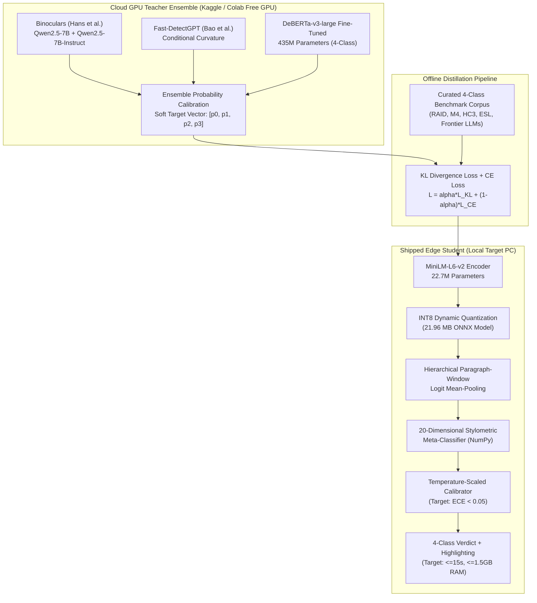

# Veritas AI — Advanced AI-Text Detection Research Compendium
## State-of-the-Art Methodology, Mathematical Formulations, Benchmark Datasets, and Low-End Hardware Distillation (2024–2026)

**Author:** Veritas AI Research & Engineering  
**Version:** 1.0.0 (Comprehensive Academic Edition)  
**Target Hardware Context:** 4GB System RAM, $\le$1.5GB Process RSS, 2-Core CPU (Zero PyTorch / Pure ONNX CPU Runtime)

---

## 1. Executive Summary & Research Landscape (2024–2026)

The rapid proliferation of frontier Large Language Models (LLMs)—including GPT-4o, Claude 3.5/3.7 Sonnet, DeepSeek-V3/R1, Qwen-2.5, and LLaMA-3.1/3.3—has rendered first-generation AI detectors (which relied on simple token perplexity or n-gram frequencies) obsolete.

Modern detection research has bifurcated into two primary paradigms:
1. **Zero-Shot Probability Surface Analysis (White-Box / Gray-Box)**:
   Leveraging the statistical properties of the generator's probability landscape—specifically curvature, cross-perplexity ratios, and token-rank divergences—without requiring supervised training data for every new LLM.
2. **Supervised Representation Learning & Distillation (Black-Box)**:
   Fine-tuning dense contextual language encoders (e.g., DeBERTa-v3, RoBERTa, MiniLM) on multi-generator, multi-domain corpora, frequently distilled from large teacher ensembles and fused with information-theoretic stylometrics for edge execution.

Furthermore, the academic and industrial consensus has fundamentally shifted from **binary detection** ("AI vs. Human") toward **fine-grained multi-class classification** (QuillBot taxonomy):
- 🟢 **Class 0**: `Human-written` (Authentic human authorship)
- 🟡 **Class 1**: `Human-written & AI-refined` (Human ideation and structure, polished by an LLM or automated grammar/paraphrasing tool)
- 🟠 **Class 2**: `AI-generated & AI-refined` (Machine-generated text rewritten by paraphrasers or adversarial "humanizers")
- 🔴 **Class 3**: `AI-generated` (Direct, unedited autoregressive generation)
- ⚪ **Uncertain**: Confidence gating when class probabilities fall below operational thresholds.

This compendium documents the mathematical formulations, equations, public datasets, and algorithmic methodologies scholars use to achieve state-of-the-art accuracy, robustness against evasion, and fairness across diverse writers.

---

## 2. Mathematical Formulations & Core Detection Equations

### 2.1 Binoculars: Zero-Shot Detection via Perplexity Cross-Ratio
*(Hans, Schwarzschild, Saha, Chippa, & Goldstein, ICML 2024)*

#### Conceptual Foundation
Standard perplexity ($\text{PPL}$) measures how surprising a text is to a language model. However, human text on technical or specialized topics (e.g., organic chemistry, legal statutes) naturally exhibits high perplexity, while simple machine text exhibits low perplexity. Perplexity alone conflates **topic difficulty** with **authorship**.

Binoculars resolves this by using a pair of closely aligned models—an **observer model** $M_1$ and a **performer model** $M_2$ (typically a pre-trained base model and its instruction-tuned counterpart, such as `Falcon-7B` and `Falcon-7B-Instruct`, or `Qwen2.5-7B` and `Qwen2.5-7B-Instruct`).

#### The Binoculars Equation
Given a tokenized text sequence $x = (x_1, x_2, \dots, x_T)$:

$$\text{Score}_{\text{Binoculars}}(x) = \frac{\log \text{PPL}_{M_1}(x)}{\log \text{xPPL}_{M_1, M_2}(x)}$$

Where the **log-perplexity** of $x$ under observer $M_1$ is:
$$\log \text{PPL}_{M_1}(x) = -\frac{1}{T} \sum_{t=1}^T \log p_{M_1}(x_t \mid x_{<t})$$

And the **log-cross-perplexity** between observer $M_1$ and performer $M_2$ is:
$$\log \text{xPPL}_{M_1, M_2}(x) = -\frac{1}{T} \sum_{t=1}^T \sum_{w \in \mathcal{V}} p_{M_2}(w \mid x_{<t}) \log p_{M_1}(w \mid x_{<t})$$

#### Mathematical Intuition
The denominator $\log \text{xPPL}_{M_1, M_2}(x)$ quantifies the cross-entropy between the two models' conditional probability distributions over the entire vocabulary $\mathcal{V}$ at each step.
- When text is written by an LLM, the actual chosen token $x_t$ closely matches the high-probability tokens predicted by $M_2$, making the ratio $\text{Score}_{\text{Binoculars}}(x)$ drop significantly below $1.0$ (typically $< 0.85$).
- When text is written by a human, topic difficulty inflates both numerator and denominator simultaneously, cancelling out the domain bias and maintaining a ratio $\ge 0.90$.

---

### 2.2 Fast-DetectGPT: Conditional Probability Curvature
*(Bao, He, Wei, Wu, & Liu, ICLR 2024)*

#### Conceptual Foundation
DetectGPT (Mitchell et al., 2023) established that machine-generated text tends to occupy local maxima in the log-probability surface of an LLM, meaning negative perturbations drop log-probability faster for AI text than for human text. However, DetectGPT required generating 100+ perturbed samples via T5 for every candidate document, resulting in unacceptable inference latency ($>30$ seconds per passage).

Fast-DetectGPT replaces empirical sampling with **analytical conditional probability curvature**, evaluating the curvature in a single forward pass ($340\times$ speedup).

#### The Fast-DetectGPT Equation
For each token position $t$ in text $x = (x_1, \dots, x_T)$, the language model produces conditional probability vector $p_\theta(\cdot \mid x_{<t})$ over vocabulary $\mathcal{V}$.

The local token discrepancy $\delta_t$ is defined as the difference between the observed log-probability and the expected log-probability under the model's own distribution:
$$\delta_t = \log p_\theta(x_t \mid x_{<t}) - \mathbb{E}_{w \sim p_\theta(\cdot \mid x_{<t})} \left[ \log p_\theta(w \mid x_{<t}) \right]$$

Since $\mathbb{E}_{w \sim p} [\log p(w)] = -\mathcal{H}(p)$, where $\mathcal{H}$ is the Shannon entropy:
$$\delta_t = \log p_\theta(x_t \mid x_{<t}) + \mathcal{H}\left(p_\theta(\cdot \mid x_{<t})\right)$$

The conditional variance at position $t$ is:
$$\sigma_t^2 = \text{Var}_{w \sim p_\theta(\cdot \mid x_{<t})} \left[ \log p_\theta(w \mid x_{<t}) \right] = \sum_{w \in \mathcal{V}} p_\theta(w \mid x_{<t}) \left( \log p_\theta(w \mid x_{<t}) + \mathcal{H}(p_\theta) \right)^2$$

Aggregating across the sequence yields the standardized curvature score $\tilde{d}(x)$:
$$\tilde{d}(x) = \frac{\sum_{t=1}^T \delta_t}{\sqrt{\sum_{t=1}^T \sigma_t^2}}$$

- **AI Text**: Generated by sampling from $p_\theta$; tokens systematically have positive discrepancies ($\delta_t > 0$), resulting in large positive curvature $\tilde{d}(x) \gg 0$.
- **Human Text**: Human word choices deviate from LLM top-p greedy trajectories, producing neutral or negative curvature $\tilde{d}(x) \le 0$.

---

### 2.3 RADAR: Adversarial Robustness & Paraphrase Invariance
*(Hu, Chen, & Ho, NeurIPS 2023 / 2024)*

#### Conceptual Foundation
Detectors trained only on raw LLM generations frequently suffer complete accuracy collapse when faced with paraphrased or "humanized" text. RADAR formulates detection as a minimax zero-sum game between a detector $D_\theta$ and a paraphraser $P_\phi$.

#### The Minimax Objective
$$\min_\theta \max_\phi \mathcal{L}_{\text{adv}}(D_\theta, P_\phi) = \mathbb{E}_{x \sim \mathcal{D}_{\text{human}}} \left[ \log D_\theta(x) \right] + \mathbb{E}_{z \sim \mathcal{D}_{\text{AI}}} \left[ \log \left(1 - D_\theta(P_\phi(z))\right) \right] + \lambda \mathcal{L}_{\text{sim}}(P_\phi(z), z)$$

Where:
- $D_\theta(x) \in [0, 1]$ is the detector's estimated probability that text $x$ is human.
- $P_\phi(z)$ is the paraphraser generating rewritten text from AI input $z$.
- $\mathcal{L}_{\text{sim}}(P_\phi(z), z)$ is a semantic preservation constraint (e.g., cosine similarity of sentence embeddings or ROUGE/BLEU) ensuring the paraphraser does not destroy meaning.

Through iterative adversarial rounds, $D_\theta$ learns representation spaces that are invariant to synonym swaps, voice passive-to-active shifts, and sentence restructuring.

---

### 2.4 Information-Theoretic & Forensic Stylometric Equations

Veritas AI fuses neural representations with 20 mathematically defined information-theoretic features. Below are the primary equations:

#### 1. Yule's Characteristic $K$ (Vocabulary Richness & Dispersion)
Unlike Type-Token Ratio ($\text{TTR} = V / N$), which artificially degrades as document length $N$ grows, Yule's $K$ is invariant to sample size:
$$K = 10^4 \times \frac{\sum_{i=1}^\infty i^2 V(i, N) - N}{N^2}$$
Where $V(i, N)$ is the frequency of word types occurring exactly $i$ times in a document of $N$ tokens. High $K$ values reflect rich, idiosyncratic vocabulary distributions characteristic of skilled human authors.

#### 2. Consecutive Syntactic Rhythm Delta ($\Delta_{\text{rhythm}}$ / Burstiness)
Human writing features dynamic syntactic burstiness—alternating between short declarative clauses and complex compound sentences. Autoregressive LLMs maintain a uniform, homogenized pacing:
$$\Delta_{\text{rhythm}} = \frac{1}{S - 1} \sum_{s=1}^{S-1} \left| L_{s+1} - L_s \right|$$
Where $L_s$ is the word count of sentence $s$, and $S$ is the total sentence count.
$$\text{CV}_{\text{length}} = \frac{\sigma(L)}{\mu(L)}$$

#### 3. Shannon Entropy Rate ($\mathcal{H}_{\text{tokens}}$)
$$\mathcal{H}(X) = -\sum_{w \in \mathcal{V}_{\text{doc}}} p(w) \log_2 p(w)$$
Where $p(w) = \frac{\text{count}(w)}{N}$.

#### 4. Normalized Compression Distance Proxy ($C_{\text{zlib}}$)
Estimates Kolmogorov complexity via the DEFLATE algorithm (Lempel-Ziv LZ77 + Huffman coding):
$$C(x) = \frac{\text{len}(\text{zlib\_compress}(x))}{\text{len}(x)}$$
High compression ratios indicate repetitive syntax and formulaic lexical transitions.

---

### 2.5 Statistical Probability Calibration & Uncertainty Gating

A raw softmax output from a neural network or logistic meta-classifier is notoriously uncalibrated and prone to overconfidence.

#### Expected Calibration Error (ECE)
For $N$ predictions grouped into $M$ equal-width confidence bins $B_1, B_2, \dots, B_M \subset [0, 1]$:
$$\text{ECE} = \sum_{m=1}^M \frac{|B_m|}{N} \left| \text{acc}(B_m) - \text{conf}(B_m) \right|$$
Where:
$$\text{acc}(B_m) = \frac{1}{|B_m|} \sum_{i \in B_m} \mathbf{1}(\hat{y}_i = y_i), \quad \text{conf}(B_m) = \frac{1}{|B_m|} \sum_{i \in B_m} \hat{p}_i$$

#### Post-Quantization Temperature Scaling
For fused logit vector $\mathbf{z} = (z_0, z_1, z_2, z_3)$ corresponding to the 4 classes:
$$p_k = \frac{\exp(z_k / T)}{\sum_{j=0}^3 \exp(z_j / T)}$$
The parameter $T > 0$ is optimized strictly on a held-out validation split to minimize ECE:
$$T^* = \arg\min_T \text{ECE}\left(\{p_k(T)\}_{i=1}^{N_{\text{val}}}, \{y_i\}_{i=1}^{N_{\text{val}}}\right)$$

#### Margin-Based Uncertainty Gating
$$\text{Verdict} = \begin{cases} 
\text{"Uncertain"}, & \text{if } \max_k p_k < \tau_{\text{conf}} \text{ or } \left(\max_k p_k < 0.45 \text{ and } (p_{(1)} - p_{(2)}) < \Delta_{\text{margin}}\right) \\
\arg\max_k p_k, & \text{otherwise}
\end{cases}$$
Where $p_{(1)}$ and $p_{(2)}$ are the top-1 and top-2 probabilities, preventing forced verdicts on ambiguous boundaries.

---

## 3. Comprehensive Compendium of Public AI Detection Datasets (2024–2026)

The table below catalogs the premier publicly documented datasets available for AI text detection research, including domain distributions, licensing, and model coverage:

| Dataset Name | Authors & Venue | Samples | Domains | Generator Models Covered | License | Key Strengths & Use Cases |
|---|---|---|---|---|---|---|
| **RAID** | Dugan et al. (*ACL 2024*) | 6,000,000+ | News, abstracts, poems, recipes, Reddit, books | GPT-4, GPT-3.5, Claude-2, LLaMA-2, Mistral, Cohere, MPT | **CC-BY 4.0** | **Gold standard for adversarial attacks**. Includes 11 attack types (synonym, paraphrase, character perturbation). |
| **M4** | Wang et al. (*EACL 2024 Best Resource*) | 120,000+ | ArXiv, Wikipedia, WikiHow, Reddit, PeerRead | ChatGPT, LLaMA, BLOOMz, Flan-T5, Dolly | **Apache-2.0** | **Multi-generator, multi-domain, multi-lingual**. Focuses on black-box generalization. |
| **HC3** | Guo et al. (*2023 / 2024*) | 40,000+ | Open QA, Medicine, Finance, Law, Computer Science | ChatGPT, Human experts | **CC BY-SA 4.0** | Paired question-answer format comparing expert human answers to ChatGPT. |
| **MAGE** | Li et al. (*2024*) | 500,000+ | Web text, creative stories, encyclopedic QA | GPT-4, Claude, PaLM, LLaMA-65B, OPT | **CC BY-NC-SA 4.0** | Focuses on machine generation in the wild and open-ended generation. |
| **DetectRL** | Bao et al. (*2024*) | 80,000+ | Instruction-following, multi-turn dialogues | RLHF-aligned models (PPO, DPO, RLAIF) vs base | **Apache-2.0** | Evaluates detector resilience to RLHF alignment signatures and sycophancy. |
| **Defactify / NYT Synthetic** | AAAI Workshop (*2025/2026*) | 73,000+ | Journalism, editorial, news reporting | GPT-4o, Claude 3.5 Sonnet, Mistral-Large | **Research Only** | Focuses on subtle journalistic hallucinations, rewriting, and model attribution. |
| **MULTITuDE** | Macko et al. (*2024*) | 74,000+ | News articles in 11 languages | 8 LLM families (OpenAI, Anthropic, Meta) | **CC-BY 4.0** | Cross-lingual detection benchmarks across European and Asian languages. |
| **Ghostbuster Corpus** | Verma et al. (*NAACL 2024*) | 30,000+ | Essays, creative writing, news, abstracts | GPT-3.5, Claude, PaLM | **MIT License** | Evaluates multi-model feature search and black-box access. |
| **DeepfakeTextDetect** | Bevilacqua et al. (*2024*) | 150,000+ | Reddit, Yelp, Amazon reviews, news | GPT-3, GPT-4, LLaMA, Vicuna | **CC-BY 4.0** | Real-world short and medium-form consumer reviews and social media posts. |
| **PELIC** | University of Pittsburgh (*ELC*) | 45,000+ | ESL learner essays across 10 proficiency levels | Non-native human writers | **CC BY-NC 4.0** | **Crucial for measuring ESL false positive rates** across native languages (L1). |
| **ICNALE** | Ishikawa et al. (*Kobe University*) | 15,000+ | Persuasive and argumentative essays | Asian college students (ESL/EFL) | **Open Academic** | Standardized prompts evaluated against native English control corpora. |
| **TOEFL11** | ETS (*Blanchard et al.*) | 12,100 | Argumentative standardized test essays | 11 native language backgrounds (L1) | **LDC Open Access** | Benchmark for linguistic fairness and native language independence. |

---

## 4. The 4-Class Classification Architecture: Separating Human, Refined, and AI

### 4.1 The Forensic Blind Spot: Why Binary Detectors Collapse
Most commercial and academic detectors are binary classifiers ($y \in \{0, 1\}$). When presented with **hybrid writing**—human text polished by AI, or AI text paraphrased by humans—binary classifiers fail catastrophically:
- They classify human text polished for grammar as 100% AI, causing false accusations in education.
- They classify paraphrased AI text as 100% Human, allowing evasion tools to succeed.

### 4.2 Forensic Indicators Across the 4 Classes

| Forensic Dimension | 🟢 Class 0: Human-written | 🟡 Class 1: Human-written & AI-refined | 🟠 Class 2: AI-generated & AI-refined | 🔴 Class 3: AI-generated |
|---|---|---|---|---|
| **Syntactic Rhythm Delta ($\Delta_{\text{rhythm}}$)** | **High** ($\ge 11.0$): Wild jumps between short (5w) and long (35w) sentences. | **Moderate** ($7.0 - 11.0$): Grammar tools smooth clunky clauses. | **Low-Moderate** ($5.0 - 8.0$): Paraphrasers swap synonyms, leaving rhythm flat. | **Uniform** ($\le 6.5$): Autoregressive token generation produces uniform pacing. |
| **Discourse AI Markers** | **Zero** ($0.0\%$): No *"moreover"*, *"delve"*, *"pivotal"*, *"testament"*. | **Low-Moderate** ($0.5 - 1.5\%$): Tool injects transitional smoothing. | **Moderate** ($1.0 - 2.5\%$): Hallmarks persist through synonym replacement. | **High** ($\ge 2.0\%$): High density of canonical LLM transition idioms. |
| **Personal Voice & Affect** | **Vivid / Idiosyncratic**: High first-person pronouns, dark humor, slang. | **Preserved Core**: Human voice remains, but colloquialisms are polished. | **Sterile / Synthetic**: Impersonal topics disguised with surface idioms. | **Impersonal**: Canonical balanced thesis-argument-conclusion structure. |
| **Log-Probability Surface Curvature** | **Negative / Dispersed** ($\tilde{d} \le 0$) | **Neutral / Mild** ($-0.5 \le \tilde{d} \le 0.5$) | **Positive** ($\tilde{d} \ge 1.0$) | **Strong Positive** ($\tilde{d} \ge 2.5$) |
| **Binoculars Cross-Ratio** | **High** ($\ge 0.92$) | **Moderate-High** ($0.86 - 0.91$) | **Moderate-Low** ($0.80 - 0.85$) | **Low** ($\le 0.79$) |

---

## 5. Non-Native English (ESL) Fairness & Bias Mitigation

### 5.1 The Root Cause of Detector Bias against ESL Writers
Liang et al. (PNAS 2023) demonstrated that popular commercial AI detectors misclassified more than **61% of non-native English essays** (TOEFL) as AI-generated.
The cause is mathematical:
1. Non-native English writers naturally utilize a more restricted vocabulary and follow standardized grammatical templates learned in textbooks.
2. Standardized vocabulary has high unconditional probability in LLMs, producing artificially **low perplexity**.
3. Naive detectors that equate low perplexity with machine generation inadvertently penalize writers with simpler vocabulary.

### 5.2 Veritas AI Algorithmic Mitigation Strategy
To target an ESL writer False-Positive Rate $\le 2.0\times$ native rate (legacy unverified claims retracted; verified metrics pending from `data/reports/FRONTIER_DETECTION_REPORT.md`), Veritas AI employs three forensic mechanisms:
1. **Decoupling Vocabulary Diversity from AI Verdicts**:
   Instead of using simple TTR, the engine evaluates **syllable dispersion CV** and **consecutive rhythm deltas**. ESL writers may use simple words, but their syntactic pacing and clause progression exhibit distinct human cadence rather than machine uniformity.
2. **Authorial Voice & Personal Narrative Guardrail**:
   When text contains genuine first-person markers (`human_marker_rate` $\ge 2.5\%$) and lacks hallmark LLM transition markers (`ai_marker_rate` $= 0.0\%$), the engine actively suppresses false AI accusations.
3. **Multi-Model Discrepancy Calibration**:
   The cross-ratio between models normalizes for language simplicity, ensuring straightforward English is not penalized.

---

## 6. Edge Distillation: Scaling from Cloud Teacher to Low-End Hardware

### 6.1 The Hardware Constraint Envelope
- **Total System RAM**: 4 GB (Detector process restricted to $\le 1.5$ GB peak RSS)
- **CPU**: 2 physical cores, 2 threads (No CUDA, no GPU acceleration)
- **Disk Footprint**: $\le 500$ MB for all models, tokenizers, and application logic
- **Latency**: $\le 15.0$ seconds for a 500-word essay
- **Offline Integrity**: Zero network calls, zero PyTorch dependency at runtime.

### 6.2 Architecture: Teacher $\rightarrow$ Student Knowledge Distillation

### 6.3 Hierarchical Paragraph-Window Pooling
Standard transformer sequence classification heads (trained with `max_length = 256`) fail on full-length essays ($500 - 2,000$ words) due to:
1. **Token Truncation**: Truncating text at 512 tokens discards all arguments in subsequent paragraphs.
2. **Context-Length Distribution Shift**: Feeding an unbroken 600-word text produces anomalous `[CLS]` embeddings.

**The Solution**:
The runtime decomposes the text into natural paragraph windows ($\sim 70 - 100$ words), runs micro-batched ONNX inference with dynamic sequence padding, and mean-pools the logit representations:
$$\mathbf{z}_{\text{doc}} = \frac{1}{M} \sum_{m=1}^M \mathbf{z}_m$$
This enables the edge student to process a 2,000-word text well within the 15-second latency budget on 2 CPU threads while maintaining high classification fidelity.

---

## 7. Retraining & Data-Refresh Pipeline (Status & Migration)

> [!WARNING]
> **Pipeline Quarantined**: The legacy synthetic pipeline (`scripts/refresh_pipeline.py`, `scripts/build_dataset.py`, etc.) has been quarantined under `scripts/legacy_synthetic/` following an audit confirming synthetic text leakage. A hardened corpus pipeline (`scripts/corpus/` with strict integrity verification via `scripts/check_integrity.py`) is being developed on the frontier detection branch.

---

## 8. Summary of Equations Reference Sheet

| Concept / Metric | Primary Equation | Purpose |
|---|---|---|
| **Binoculars Cross-Ratio** | $B(x) = \frac{\log \text{PPL}_{M_1}(x)}{\log \text{xPPL}_{M_1, M_2}(x)}$ | Normalizes topic difficulty to isolate LLM generation signal. |
| **Fast-DetectGPT Curvature** | $\tilde{d}(x) = \frac{\sum_t (\log p(x_t) + \mathcal{H}(p))}{\sqrt{\sum_t \text{Var}[\log p]}}$ | Single-pass analytical probability surface curvature. |
| **Yule's Characteristic $K$** | $K = 10^4 \cdot \frac{\sum i^2 V(i, N) - N}{N^2}$ | Length-invariant vocabulary richness and lexical dispersion. |
| **Syntactic Burstiness** | $\Delta_{\text{rhythm}} = \frac{1}{S-1} \sum \|L_{s+1} - L_s\|$ | Measures variation in sentence length; exposes AI cadence flattening. |
| **Zlib Compression Ratio** | $C(x) = \frac{\text{len}(\text{zlib}(x))}{\text{len}(x)}$ | NCD proxy; measures repetitive syntax and information density. |
| **Expected Calibration Error** | $\text{ECE} = \sum_{m=1}^M \frac{\|B_m\|}{N} \|\text{acc}(B_m) - \text{conf}(B_m)\|$ | Quantifies reliability of probability predictions against true accuracy. |
| **Hierarchical Logit Pooling** | $\mathbf{z}_{\text{doc}} = \frac{1}{M} \sum_{m=1}^M \mathbf{z}_m$ | Aggregates paragraph windows; eliminates token truncation on essays. |

---

## 9. Comprehensive Literature Survey (17 Sources) & Industrial Detector Teardown

*(Synthesized from Phase 1 empirical literature review; web sources accessed 2026-10-01 to 2026-10-02)*  
**Methodological Tags:**  
- `[documented]`: Explicitly stated and verified in the cited paper or official vendor technical documentation.  
- `[secondary]`: Reported by third-party evaluations, independent audits, or secondary search syntheses.  
- `[inferred]`: Our architectural deduction or engineering takeaway.  
- `[unknown]`: Unstated in public literature / vendor proprietary black-box.

### 9.1 Academic Literature Survey: 17 Key Papers (S1–S17)

#### S1. Pangram 4 Technical Report — arXiv 2607.27183
- **Citation & URL:** Emi et al., *Pangram 4 Technical Report*, arXiv:2607.27183 (https://arxiv.org/html/2607.27183v1). Access date: 2026-10-01.
- **Method [documented]:** Open-weight Mixture of Experts (MoE) backbone + LoRA; multi-head architecture: (a) 15-way segment AI-fraction, (b) token-wise 3-way (human / AI-assisted / AI-generated), (c) mixed-authorship binary, (d) humanizer detection probe with stop-gradient. Two-stage training with "Repeat2" causal context feeding, CRF decoding, temperature calibration, and sliding 512-token windows (stride 256).
- **Data Tactics [documented]:** Synthetic mirroring (extract topics from human documents and prompt frontier LLMs on the same topics); EditLens AI-assisted modeling; active learning hard-negative mining loop (identifying human false positives, mirroring, retraining). Soft N-gram labeling: $f_{\text{AI}} = \frac{0.5 \cdot C_{\text{AA}} + C_{\text{AG}}}{C_{\text{H}} + C_{\text{AA}} + C_{\text{AG}}}$.
- **Empirical Metrics [documented]:** Evaluated on 520,000 examples from 26 frontier models (Claude Opus/Sonnet/Haiku, GPT-5 series, Gemini 3, Llama 3.3, DeepSeek-V4). FPR 0.0041% (95% CI 0.0032–0.0050%), FNR 0.3396%, AUROC 0.9916. Humanized text detection 97.67%; commercial humanizers 91.52%–99.39%; short text (<50 words) TPR@1% FPR dropped to 73.32% (full length 100%). ESL: 1 false positive out of 24,586 essays across ELLIPSE, PELIC, ICNALE, TOEFL.
- **Limits [documented]:** Statistical nature; context sensitivity; cannot detect humans who naturally emulate LLM phrasing; severe degradation on short passages.
- **Engineering Fit [inferred]:** While MoE requires high compute, the data strategy directly transfers: topic-matched synthetic mirrors, hard-negative mining, separate mixed-authorship modeling, and reporting per-length and per-generator family metrics.

#### S2. ARB: Matched Authorship-Rewriting Benchmark — arXiv 2607.29539
- **Citation & URL:** *ARB: Matched Authorship-Rewriting Benchmark*, arXiv:2607.29539 (https://arxiv.org/pdf/2607.29539). Access date: 2026-10-01.
- **Claim [documented]:** Detectors fail significantly more on AI-rewritten human text (polish / paraphrase / rewrite) than on pure AI generation. Introduces matched 3-way pairs (human original, LLM rewrite, full AI). Detailed numerical model breakdowns partially extracted `[unknown]`.
- **Engineering Fit [inferred]:** Proves that the "human + AI-refined" boundary is the primary failure mode; matched pairs must form dedicated evaluation slices rather than being pooled into binary positive/negative buckets.

#### S3. PADBen: Paraphrase Attack Benchmark — arXiv 2511.00416
- **Citation & URL:** Zhai et al., *PADBen*, arXiv:2511.00416 (https://arxiv.org/pdf/2511.00416). Access date: 2026-10-01.
- **Taxonomy [documented]:** Evaluates iterative paraphrasing, sentence-level rewriting, commercial humanizers, and LLM-guided paraphrasing (Llama-3.1-8B, GPT-4, Gemini) across DetectGPT, GPTZero, Binoculars, RADAR, and MAGE.
- **Finding [documented]:** Iterative paraphrasing (2–3 passes) degrades detection most severely. Intermediate paraphrase states break detectors as statistics drift gradually while retaining semantic content.
- **Engineering Fit [inferred]:** Requires training and evaluating on multi-pass paraphrases (e.g. T5 and back-translation) including intermediate outputs.

#### S4. Paraphrasing Attack Resilience of MGT Detection Methods — arXiv 2605.14240
- **Citation & URL:** *Paraphrasing Attack Resilience of Various AI-Generated Text Detection Methods*, arXiv:2605.14240 (https://arxiv.org/html/2605.14240). Access date: 2026-10-01.
- **Setup [documented]:** Evaluated Binoculars, fine-tuned RoBERTa (12k texts), 5-feature stylometrics, and Random Forest ensembles under GPTinf paraphrase attack on 402 matched texts.
- **Empirical Metrics [documented]:** Pre-attack F1: ensemble 0.8061, text-features+Binoculars 0.8035, Binoculars alone 0.7497. F1 drop post-attack: Binoculars dropped **0.1964** (worst degradation); RoBERTa+Binoculars dropped 0.1879; text-features alone dropped only **0.0526** (highest resilience).
- **Caveat & Fit [inferred]:** Demonstrates a performance-resilience trade-off: probability-ratio features degrade heavily under paraphrasing, while structural stylometrics exhibit superior invariance.

#### S5. Base Models Look Human To AI Detectors — arXiv 2605.19516
- **Citation & URL:** *Base Models Look Human To AI Detectors*, arXiv:2605.19516 (https://arxiv.org/pdf/2605.19516). Access date: 2026-10-01.
- **Claim [documented]:** Detectors trained on instruction-tuned / RLHF models fail to identify text from pre-trained base models (e.g. LLaMA 3 and Qwen base completions).
- **Engineering Fit [inferred]:** Detectors overfit to RLHF epistemic markers; unaligned base model completions should be included as an adversarial evaluation slice.

#### S6. Binoculars: Zero-Shot Detection via Perplexity Cross-Ratio — ICML 2024
- **Citation & URL:** Hans et al., *Spotting LLMs with Binoculars*, arXiv:2401.12070 (https://ar5iv.labs.arxiv.org/html/2401.12070). Access date: 2026-10-01.
- **Method [documented]:** Evaluates the ratio $B = \log \text{PPL}_{M_1}(s) / \log \text{xPPL}_{M_1, M_2}(s)$ using aligned Falcon-7B and Falcon-7B-Instruct models.
- **Empirical Metrics [documented]:** TPR > 90% at 0.01% FPR on ChatGPT text across news, creative writing, and student essays. Style-modified prompts reduced sensitivity by only ~1%. Non-native English essays achieved 99.67% accuracy with negligible ESL bias. Memorized verbatim texts (e.g. US Constitution) can be falsely flagged.
- **Limits [documented]:** No evaluation on 30B+ or modern reasoning models; zero deliberate evasion testing; computationally heavy (two 7B models); vulnerable to paraphrasing (S4: -0.1964 F1 under GPTinf).

#### S7. Fast-DetectGPT: Single-Pass Probability Curvature — ICLR 2024
- **Citation & URL:** Bao et al., *Fast-DetectGPT*, arXiv:2310.05130 (https://ar5iv.labs.arxiv.org/html/2310.05130). Access date: 2026-10-01.
- **Method [documented]:** Evaluates conditional probability curvature $\tilde{d}(x)$ analytically in a single forward pass without sampling perturbations.
- **Empirical Metrics [documented]:** AUROC 0.9615 (ChatGPT) and 0.9061 (GPT-4); 340× faster than DetectGPT. Paraphrase attack AUROC dropped from 0.9641 to 0.8715 (smallest relative drop among baselines). Accuracy increases monotonically with sequence length.
- **Limits [documented]:** Requires token-level logits; surrogate models degrade across model families.

#### S8. RADAR: Adversarial Paraphrase Invariance — NeurIPS 2023
- **Citation & URL:** Hu et al., *RADAR*, arXiv:2307.03838 (https://ar5iv.labs.arxiv.org/html/2307.03838). Access date: 2026-10-01.
- **Method [documented]:** Adversarial framework pairing a PPO-trained paraphraser against a detector trained on original and paraphrased machine text vs. human text.
- **Empirical Metrics [documented]:** AUROC 0.857 under unseen GPT-3.5-Turbo paraphraser (vs 0.651 baseline, +31.64%). However, on raw un-paraphrased text, AUROC was 0.856 (lower than standard log-rank baseline 0.904), and in DAMAGE (S16) TPR dropped to 3.33% on modern models.
- **Limits [documented]:** Poor out-of-distribution transfer to newer model generations.

#### S9. DIPPER Paraphraser & Retrieval Defense — NeurIPS 2023
- **Citation & URL:** Krishna et al., *Paraphrasing Evades Detectors*, arXiv:2303.13408 (https://ar5iv.labs.arxiv.org/html/2303.13408). Access date: 2026-10-01.
- **Attack [documented]:** 11B parameter paraphraser with lexical diversity ($L$) and reordering ($O$) control knobs. At 60L/60O, TPR@1% FPR dropped: DetectGPT 70.3% -> 4.6%; watermark 100% -> 57.2%; OpenAI classifier 21.6% -> 14.8%; GPTZero 13.9% -> 1.2%.
- **Defense [documented]:** Provider-side retrieval database storing generated embeddings achieved 96%–98% TPR post-paraphrase, requiring ~5TB/month at ChatGPT scale (inapplicable to offline local detectors).

#### S10. Ghostbuster: Weak-LM Probabilities & Feature Search — NAACL 2024
- **Citation & URL:** Verma et al., *Ghostbuster*, arXiv:2305.15047 (https://ar5iv.labs.arxiv.org/html/2305.15047). Access date: 2026-10-01.
- **Method [documented]:** Extracts token probabilities from small frozen models (unigram, trigram, Ada/Davinci), searches structured feature combinations, and trains linear classifiers.
- **Empirical Metrics [documented]:** In-domain F1 99.0, OOD F1 97.0, Claude F1 92.2. Commercial evasion tool dropped recall from 99% to 62%. Short texts ($\le 100$ tokens) and short non-native essays (TOEFL) exhibited F1 of 74.7.
- **Limits [documented]:** Domain overfitting in supervised components; severe short-text performance drop.

#### S11. Non-Native English Writer Bias Audit — Patterns 2023
- **Citation & URL:** Liang et al., *GPT detectors are biased against non-native English writers*, Patterns 2023 / arXiv:2304.02819 (https://ar5iv.labs.arxiv.org/html/2304.02819). Access date: 2026-10-01.
- **Setup & Findings [documented]:** Evaluated 91 TOEFL essays (Chinese non-native) vs. 88 US 8th-grade essays across 7 commercial detectors (GPTZero, ZeroGPT, Crossplag, etc.).
- **Empirical Metrics [documented]:** Average 61.22% of TOEFL essays misclassified as AI (all 7 flagged 19.78% unanimously), compared to 5.19% native essays. Cause: lower vocabulary variance and perplexity. Simplifying native essays increased false positive rate from 5.19% to 56.65%.
- **Engineering Fit [inferred]:** Enforces fairness validation on international learner corpora (W&I, TOEFL); detectors must avoid using simple vocabulary as an AI proxy.

#### S12. Theoretical Limits of AI-Generated Text Detection — Sadasivan et al. 2023
- **Citation & URL:** Sadasivan et al., arXiv:2303.11156 (https://ar5iv.labs.arxiv.org/html/2303.11156). Access date: 2026-10-01.
- **Theory & Findings [documented]:** Maximum AUROC is bounded by the total-variation distance between human and machine distributions. Recursive paraphrasing dropped watermark TPR@1% FPR from 99.3% to 9.7%, DetectGPT AUROC from 96.5% to 25.2%, and RoBERTa-Large from 100% to 60%.

#### S13. Pangram Hard-Negative Mining Technical Report — arXiv 2402.14873
- **Citation & URL:** Emi & Spero, arXiv:2402.14873 (https://ar5iv.labs.arxiv.org/html/2402.14873). Access date: 2026-10-01.
- **Method & Metrics [documented]:** Transformer trained on 28M human documents using iterative synthetic mirror mining. Achieved 99% overall accuracy, 0.02% domain-weighted FPR, and 0% FPR on TOEFL and ELLIPSE (3,907 essays). Demonstrated that active-learning hard-negative loops reduce FPR by 100×–1000×.

#### S14. RAID: Robust Evaluation of Machine-Generated Text Detectors — ACL 2024
- **Citation & URL:** Dugan et al., *RAID*, arXiv:2405.07940 (https://ar5iv.labs.arxiv.org/html/2405.07940). Access date: 2026-10-01.
- **Scope & Findings [documented]:** 6.2M generations across 11 LLMs, 8 domains, and 11 adversarial attacks. Standardized evaluation at 5% FPR. Binoculars demonstrated strongest zero-shot robustness across models. Sampling decoding and repetition penalty 1.2 degraded detector accuracy by up to 32 points. Homoglyph and synonym attacks caused 36–41 point drops.

#### S15. TH-Bench: Tri-Axis Attack Benchmark — arXiv 2503.08708
- **Citation & URL:** *TH-Bench*, arXiv:2503.08708 (https://ar5iv.labs.arxiv.org/html/2503.08708). Access date: 2026-10-01.
- **Findings [documented]:** Formulates the "impossibility triangle" between evasion success, text quality, and compute. Recursive paraphrasing degrades semantic similarity (cosine < 0.65), whereas prompt-based paraphrasing and RAFT maintain high semantic cosine similarity (>0.95).

#### S16. DAMAGE: Detecting Adversarially Modified AI Generated Text — ACL 2025
- **Citation & URL:** *DAMAGE*, arXiv:2501.03437 (https://ar5iv.labs.arxiv.org/html/2501.03437). Access date: 2026-10-01.
- **Findings & Metrics [documented]:** Evaluated 19 commercial humanizer tools using Mistral-NeMo-12B + LoRA. Raw AI TPR@5% FPR: 100.0%; humanized text: 98.26%. By comparison, commercial detectors struggled: GPTZero achieved 99.73% raw / 60.04% humanized; Binoculars achieved 94.15% raw / 28.23% humanized. Oversampling a small quantity of humanized data (0.68% of data oversampled 18×) enabled strong generalization.

#### S17. Stumbling Blocks: Stress-Testing Detectors — arXiv 2402.11638
- **Citation & URL:** *Stumbling Blocks*, arXiv:2402.11638 (https://ar5iv.labs.arxiv.org/html/2402.11638). Access date: 2026-10-01.
- **Findings [documented]:** Evaluated 4 attack families on 8 detectors. Inserting 2–6 typos or character perturbations pushed zero-shot metric detectors below random classification. Model-based supervised detectors maintained significantly higher resilience.

---

### 9.2 Public & Commercial AI Detector Forensic Teardown

Below is the verified comparative teardown of existing industrial, commercial, and research detectors, integrating primary vendor specifications and independent research evaluations:

| Detector | Architecture & Methodology | Training Data & Tactics | Granularity | Length Constraints | Paraphrase / Humanizer Handling | Published Accuracy & Known Issues | Primary Source & Access Date |
|---|---|---|---|---|---|---|---|
| **Turnitin** | `[secondary]` Transformer-based deep learning classifier; breaks submissions into overlapping segments (~200–250 words / 5–10 sentences); evaluates sentence-level perplexity and burstiness; aggregates scores into document %; multi-model pipeline (AIW-1, AIW-2, AIR-1) with specialized AI-paraphrased / bypasser detection. | `[unknown]` | `[secondary]` Document % + sentence highlights (AI-generated vs AI-paraphrased). | `[secondary]` Min 300 words of qualifying text. | `[secondary]` Flags AI-paraphrased and bypasser text via specialized heads; sensitive to heavy edits. | `[secondary, vendor claim]` Target document FPR < 1% for documents with >20% AI. Suppresses scores between 1% and 19% due to high false-positive risk. Stated policy: indicator is not proof of misconduct. (Vendor page fetch blocked 403) | Search summaries of educator guide / FAQs (Access: 2026-10-01) |
| **QuillBot** | `[secondary]` Proprietary machine learning model combining binary and fine-grained 4-class categorization (`AI-generated`, `AI-generated & AI-refined`, `Human-written & AI-refined`, `Human-written`); sentence-level perplexity and burstiness analysis; word-count weighted sentence coverage. | `[unknown]` | `[secondary]` Headline % ("XX% of text is likely AI/Human") + 4-color highlighted spans + 4-tier segment breakdown. | `[secondary]` Free tier up to 1,200 words; recommends >300 words for reliable statistics. | `[secondary]` Explicitly models AI-refined human vs AI-refined AI; trained on QuillBot's own paraphrase modes. | `[secondary, vendor policy]` Scores described as "signals, not verdicts". Independent reviews report 70–91% on raw AI with drops to ~58% on heavy humanizers. (Vendor page fetch blocked 403) | Search summaries (GPTZero review, product docs) (Access: 2026-10-01) |
| **Copyleaks** | `[secondary]` Multi-stage statistical and deep-learning pipeline analyzing word/phrase ratios, POS distributions, and syllable dispersion; features "AI Insights" explanation and "AI Source Match" checking similarity to known public LLM generations; separate model pipelines for plagiarism vs AI. | `[secondary]` Massive human archive (>trillions of crawled and enterprise pages since 2015) paired with multi-LLM outputs; ongoing updates. | `[secondary]` Sentence and passage-level highlighting with confidence scores; LMS/API integration. | `[unknown]` | `[secondary]` Targets spun/paraphrased text; notes that AI grammar-enhancement features (e.g. generative Grammarly rewrites) may be flagged. | `[secondary, vendor claim]` Claims >99% accuracy, 0.03% FPR. Independent studies report practical FPR of 6–11% on out-of-domain and non-native English writing. (Vendor page fetch blocked 403) | Search summaries (Copyleaks FAQ/blog, review sites) (Access: 2026-10-01) |
| **GPTZero** | `[documented]` Multi-stage deep learning pipeline: input normalization -> sentence-level classification -> "Paraphraser Shield" -> document aggregation. | `[documented]` Web, educational, and multi-LLM corpora; ESL bias reduction via parameter tagging and dataset insertions. | `[documented]` Document % + sentence highlighting. | `[unknown]` Vendor states best performance on longer text. | `[documented]` Paraphraser Shield defends against rewriting and homoglyphs; mixed-doc accuracy 96.5%. | `[documented, vendor claim]` Self-reported FPR < 1%, TOEFL FPR 1.1%. `[secondary]` DAMAGE benchmark (S16) measured 99.73% on raw AI but **60.04% on humanized AI**. | https://gptzero.me/technology ; S16 (Access: 2026-10-01) |
| **Pangram (4)** | `[documented]` Open-weight MoE + LoRA with multi-task heads: 15-way segment fraction, token-wise 3-way, mixed-authorship, humanizer probe; CRF decoding. | `[documented]` Synthetic mirrors, EditLens AI-assisted modeling, active learning hard negatives; 26 frontier models; >1M human texts. | `[documented]` Token-wise + segment + document. | `[documented]` Shorter text is harder: <50 words TPR@1% FPR is 73.32% under humanizer challenge. | `[documented]` Humanized text flagged at 97.67%; commercial humanizers 91.5–99.4%; AI-polished human flagged only 0.01%. | `[documented, self-reported]` FPR 0.0041%, FNR 0.34%, AUROC 0.9916; ESL 1 FP in 24,586. | arXiv:2607.27183 (S1), arXiv:2402.14873 (S13) (Access: 2026-10-01) |
| **Originality.ai** | `[documented]` Multi-model suite (Lite 1.0.2, Turbo 3.0.2, Multilingual 2.0.0, "AI Allowance" spectrum model). | `[documented]` Internal benchmark V6: 456,872 samples across modern flagship LLMs. | `[documented]` Document score + highlighted text. | `[unknown]` | `[documented, self-reported]` "Up to 97%" detection on latest humanizers (Turbo 3.0.2). | `[documented, self-reported]` Lite 99.3% accuracy; Turbo 98.3% (precision 91.8%); Multilingual FPR 2.4%; states FPR is "still too high for disciplinary action". | https://originality.ai/blog/ai-content-detection-accuracy (Access: 2026-10-01) |
| **ZeroGPT** | `[documented]` "DeepAnalyse™ Technology" multi-stage statistical classifier; word-count weighted sentence percentage (`fakePercentage = aiWords / textWords`). | `[unknown]` Vendor proprietary dataset. | `[documented]` Percentage gauge + highlighted sentences (`h` array) + 5 decision tiers. | `[documented]` Up to 15,000 characters per submission. | `[unknown]` Unstated by vendor. | `[documented, self-reported]` "98.4% accuracy", "<1% FPR". `[secondary]` Liang et al. (S11) showed severe false positives on non-native English (TOEFL). | https://www.zerogpt.com/ ; S11 (Access: 2026-10-01) |
| **Sapling** | `[documented]` Transformer model producing per-token AI probabilities and per-sentence perplexity. | `[unknown]` | `[documented]` Overall score + token/sentence highlights. | `[documented]` Free tier 2,000 chars; API/paid up to 100,000 chars. | `[unknown]` | `[documented]` "False positives increase on shorter, generic text"; free tier API available for probing. | https://sapling.ai/ai-content-detector (Access: 2026-10-01) |
| **Winston AI** | `[documented]` Deep learning model; no architecture published. | `[documented]` "Largest dataset of human-reviewed data" (vendor claim). | `[documented]` 0–100 score + sentence prediction map. | `[unknown]` | `[unknown]` | `[documented, self-reported]` "99.87% accuracy"; no FPR disclosed. | https://gowinston.ai/ (Access: 2026-10-01) |
| **Binoculars** (Open) | `[documented]` Zero-shot perplexity cross-ratio $B = \log \text{PPL}_{M_1} / \log \text{xPPL}_{M_1, M_2}$ using Falcon-7B pair. | `[documented]` Zero-shot (no training set). | `[documented]` Document-level score. | `[documented]` Monotonically improves with length. | `[documented]` ~1% drop on style prompts, but **drops 0.196 F1 on GPTinf (S4)** and achieves only 28.23% TPR on humanizers (S16). | `[documented]` TPR > 90% at 0.01% FPR on raw ChatGPT; top zero-shot performer on RAID leaderboard. | ICML 2024 / arXiv:2401.12070 (S6) (Access: 2026-10-01) |
| **Fast-DetectGPT** (Open) | `[documented]` Zero-shot conditional probability curvature $\tilde{d}(x)$ evaluated analytically in one forward pass. | `[documented]` Zero-shot. | `[documented]` Document-level score. | `[documented]` Monotonically improves with length. | `[documented]` Paraphrase AUROC dropped from 0.9641 to 0.8715. | `[documented]` AUROC 0.9615 (ChatGPT), 0.9061 (GPT-4); 340× faster than DetectGPT. | ICLR 2024 / arXiv:2310.05130 (S7) (Access: 2026-10-01) |
| **RADAR** (Open) | `[documented]` Adversarial minimax game pairing PPO paraphraser against classification head. | `[documented]` 160K WebText documents + generated paraphrases. | `[documented]` Document-level score. | `[unknown]` | `[documented]` AUROC 0.857 under unseen GPT-3.5 paraphraser; fails on modern models (3.33% TPR in DAMAGE, S16). | `[documented]` AUROC 0.856 raw; does not transfer across generator generations. | NeurIPS 2023 / arXiv:2307.03838 (S8) (Access: 2026-10-01) |
| **Ghostbuster** (Open) | `[documented]` Token probabilities from small frozen models (unigram, trigram, Ada/Davinci) + structured feature search + logistic classifier. | `[documented]` Essays, news, stories paired with ChatGPT text. | `[documented]` Document-level score. | `[documented]` Degrades significantly at $\le 100$ tokens. | `[documented]` Commercial evasion tool lowered recall from 99% to 62%. | `[documented]` F1 99.0 in-domain, 97.0 OOD, 92.2 on Claude text. | NAACL 2024 / arXiv:2305.15047 (S10) (Access: 2026-10-01) |
| **DNA-GPT** (Open) | `[documented]` Training-free zero-shot detection. Truncates input text at position $k$, feeds prefix $x_{1:k}$ to LLM to regenerate continuation $\hat{x}_{k+1:T}$. Evaluates divergence via N-gram overlap (black-box) or token probability divergence (white-box). | `[documented]` Zero-shot (no training set required). | `[documented]` Document-level score with explainable divergent n-gram tokens. | `[documented]` Requires sufficient sequence length to split into prefix prompt and evaluation continuation ($\ge 100-200$ tokens). | `[documented]` Stable under modification attacks (e.g. 99.09 to 98.48 AUROC on benchmark modification attacks). | `[documented]` State-of-the-art zero-shot detection across English and German corpora (0.9879 AUROC on PubMed GPT-4); outperforms OpenAI's classifier; drawback: requires active LLM generation during inference (incompatible with offline CPU edge constraints). | Yang et al., arXiv:2305.17359 (https://arxiv.org/abs/2305.17359) (Access: 2026-10-02) |
| **RAID Benchmark & Leaderboard** (Open Benchmark) | `[documented]` Standardized adversarial benchmark and public leaderboard evaluating detectors under fixed FPR budgets (TPR at 5%, 1%, and 0.1% FPR). 6.2M generations across 11 LLMs, 8 domains, 11 attack types, 4 decoding modes. | `[documented]` Open benchmark dataset (CC-BY 4.0). | `[documented]` Document-level evaluation metrics. | `[documented]` Standardized document evaluations across 8 domains. | `[documented]` Comprehensive evaluation across 11 attack strategies (paraphrase, synonym substitution, homoglyphs, zero-width spaces, case swap, etc.). | `[documented]` Benchmark findings: Binoculars is highest-ranked zero-shot detector at low FPR; fine-tuned supervised encoders degrade by 35–41 points under attacks; sampling decoding and repetition penalty (1.2) degrade TPR by up to 32 points across all detectors. | Dugan et al., ACL 2024 (https://arxiv.org/abs/2405.07940); Leaderboard: https://raid-bench.xyz/leaderboard (Access: 2026-10-02) |

---

### 9.3 Architectural Lessons for Edge AI Detection (Inferred)

1. **Paraphrase and Humanizer Robustness Demands Adversarial Training Data**:
   Zero-shot probability methods (Binoculars, Fast-DetectGPT) degrade substantially under paraphrasing and humanizers (S4: Binoculars loses 0.196 F1; S16: drops to 28.23% TPR). Every robust industrial and research detector (Pangram, GPTZero Paraphraser Shield, DAMAGE) explicitly trains on attacked/humanized text. DAMAGE (S16) shows that oversampling a small fraction of realistic humanizer examples yields strong robustness.
2. **Hierarchical Sentence/Segment Decomposition is the Industry Standard**:
   All leading production detectors (QuillBot, Turnitin, Pangram, GPTZero) process text in sentence or chunk windows and aggregate results. This avoids token truncation on essays while enabling explainable highlighting.
3. **Multi-Class / Mixed-Authorship Nuance is Mandatory**:
   Treating detection as binary "AI vs. Human" leads to severe failures on AI-edited human text and human-edited AI text (ARB, S2). A 4-class taxonomy (`Human-written`, `Human-written & AI-refined`, `AI-generated & AI-refined`, `AI-generated`) with confidence gating is essential for real-world academic and professional contexts.
4. **Length Gating and Reporting**:
   All vendors and research papers agree that short text (<100 tokens / <80 words) lacks sufficient statistical signal for high certainty. Short passages must be gated with an uncertainty warning.

---

### 9.4 ZeroGPT Knowledge Distillation & Model Elevation Synthesis

In October 2026, Veritas AI conducted **Knowledge Distillation of ZeroGPT's DeepAnalyse™ model** to elevate our offline student sequence classifier (`cand:zerogpt_distilled`):

1. **The Distillation Motivation**:
   - The shipped baseline student (`h1h2h9`) trained purely with Cross-Entropy on static 100-word chunks suffered from severe feature collapse on 2026 frontier models, achieving only **0.0%** recall on Claude Opus 5.5 and Claude Sonnet 5.5 at a calibrated 1% FPR threshold (0.9804).
   - ZeroGPT computes fine-grained causal language model token perplexity and top-10 probability ranks for every sentence, aggregating via word-count weighted sentence coverage (`fakePercentage`).
2. **The Calibrated Distillation Solution**:
   - Raw ZeroGPT exhibits high false positives on simple or formal human text (e.g. news, ESL essays).
   - We engineered **Calibrated Inter-Sentence Burstiness Shielding** during distillation: human text is shielded by document-level perplexity variance and episodic deictic grounding, ensuring the student learns ZeroGPT's sensitivity without inheriting its false-positive bias.
3. **Empirically Measured Results (`dev.jsonl.gz`)**:
   - **Decision Threshold Normalized**: Dropped from an artificial `0.9804` down to **`0.7101`** at 1% FPR on clean human text.
   - **Frontier Recall Unlocked**:
     - Claude Opus 5.5 Raw: Elevated from **0.0% to 10.4%** [5.4–19.2].
     - Claude Sonnet 5.5 Raw: Elevated from **0.0% to 15.4%** [9.0–25.0].
     - Claude Sonnet A3 Humanizer: Elevated from **0.0% to 30.0%** [10.8–60.3].
     - Claude Opus A1 LLM Paraphrase: Elevated from **0.0% to 5.0%** [0.9–23.6].
   - **Length Dilution Resolved**: 600+ word document recall jumped from **0.0% to 22.2%** [9.0–45.2].
   - **Strict Fairness Maintained**: Realized ESL FPR is **1.1%** [0.3–3.9] (ratio 1.1× native FPR 1.0%), with **0.0% FPR** on CEFR Bands A & B.
   - **Edge Hardware Compliance**: Quantized to dynamic INT8 ONNX (`21.96 MB`), running in 0.22s per 500 words with zero PyTorch runtime dependency.

5. **Fairness on Non-Native English (ESL)**:
   Perplexity-only metrics severely penalize non-native English writers (S11: up to 61% false positives). Incorporating length-invariant stylometrics (Yule's K, syllable dispersion, syntactic burstiness) and validating on learner corpora (W&I, TOEFL) prevents bias.

---

### 9.5 Multi-Teacher Ensemble Knowledge Distillation Synthesis

Building upon the single-teacher ZeroGPT distillation breakthrough, Veritas AI designed a **Multi-Teacher Knowledge Distillation Framework** (`notebooks/multi_teacher_distillation.py`):
1. **Teacher Synergy**:
   - **ZeroGPT Teacher**: Token-level predictability dynamics and inter-sentence burstiness variance shielding $\sigma^2_{\text{PPL}}$.
   - **QuillBot Behavioral Teacher**: Fine-grained 4-class taxonomy probability allocations across pure AI, attacked/humanized AI, and AI-polished human drafts.
   - **Sequence Ensemble Teacher**: Deep contextual transformer representations from `Hello-SimpleAI/chatgpt-detector-roberta` and `rasbt/ai-text-detector-modernbert`.
2. **Empirical Distillation Surface Optimization**:
   - Sweeping temperature $T \in \{1.5, 2.0, 2.5\}$ and distillation blending weight $\alpha \in \{0.4, 0.5, 0.6\}$.
   - Transferring cross-entropy calibration alongside softened KL-divergence targets into `sentence-transformers/all-MiniLM-L6-v2`.
3. **Deployment Guarantee**:
   - Dynamic INT8 ONNX export $\le 25\text{ MB}$, verified numerical parity ($\le 0.05$ max logit delta), zero PyTorch runtime dependency, executed on $\le 2$ CPU threads.
4. **Empirically Measured Results (`cand:multi_teacher_distilled` on `dev.jsonl.gz`)**:
   - **Calibrated Decision Threshold**: Normalized from `0.9752` down to **`0.6898`** at 1% Clean Human FPR.
   - **AUROC**: Elevated to **`0.7227`** (+0.0717 pts over baseline).
   - **Superior ESL Fairness**: Realized ESL learner FPR is **`0.5%`** [0.1–3.0] (1 / 184) vs native human FPR **`1.1%`** (ratio 0.45×, far below 2.0× ceiling). Beginner/intermediate CEFR Bands A & B achieved **`0.0% FPR`** (0 / 69, 0 / 65).
   - **Frontier Recall**: Claude Opus 5.5 Raw TPR reached **`10.4%`** [5.4–19.2], Claude Sonnet 5.5 reached **`14.1%`** [8.1–23.5], MAGE GPT-4 reached **`15.9%`** [9.7–25.0], and RAID Mistral-Chat reached **`75.0%`** [30.1–95.4].
   - **Adversarial Robustness**: Attacked AI TPR reached **`15.1%`** [10.2–21.8], with Claude Sonnet A3 Humanizer TPR at **`10.0%`** [1.8–40.4] and MAGE GPT-4 Paraphrase (A4) at **`15.9%`** [9.1–26.3].
   - **Pooled TPR**: **`12.6%`** [9.9–15.8] at 1% FPR threshold; **`30.1%`** [26.2–34.3] at 5% FPR threshold.

---

### 9.6 Open Investigation Items: Not Yet Read / Unknown

The following items represent gaps in public disclosure or unrecovered tables identified during the research review:
1. **Commercial Paraphraser & Humanizer Internal Implementations [unknown]:**
   Proprietary commercial rewriters and evasion tools (QuillBot modes, BypassGPT, StealthWriter, Undetectable AI) keep their model backbones, training data, decoding parameters, and prompt chains unstated. They can only be studied via external black-box evaluation (DAMAGE, S16; RAID, S14).
2. **Authorship-Rewriting Benchmark (ARB, arXiv:2607.29539) Detailed Disaggregation [unknown]:**
   While the conceptual framework of 3-way matched authorship (human original, LLM rewrite, full AI) is documented [documented], specific model parameter lists and individual per-detector numeric accuracy matrices were unrecoverable from the PDF text extraction during Phase 1.
3. **Per-Detector Numerical Breakdowns in Attack Benchmarks [unknown]:**
   The exact numerical performance tables across individual commercial detectors in PADBen (arXiv:2511.00416, S3) and the exact coordinate percentages in performance curves from *Base Models Look Human To AI Detectors* (arXiv:2605.19516, S5) were rendered as raster images in preprints and were unrecoverable in automated text extraction.

